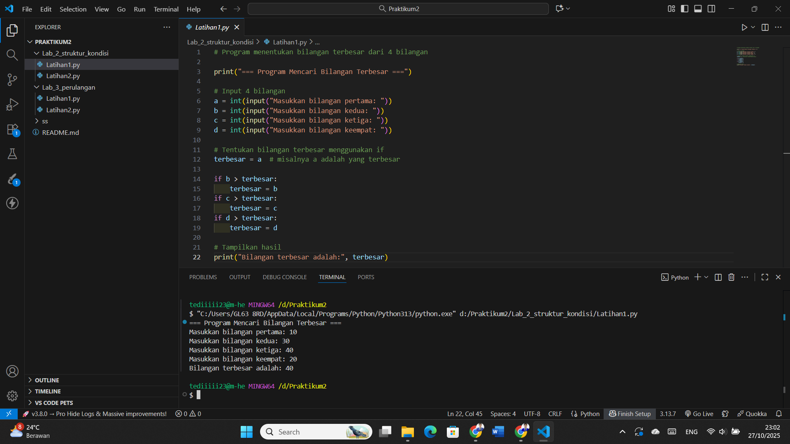
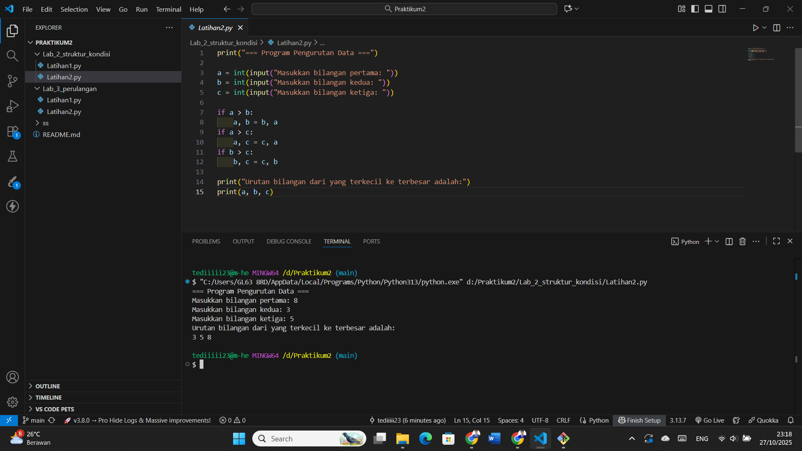
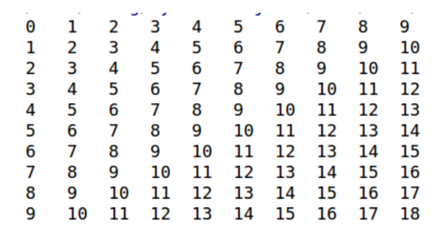
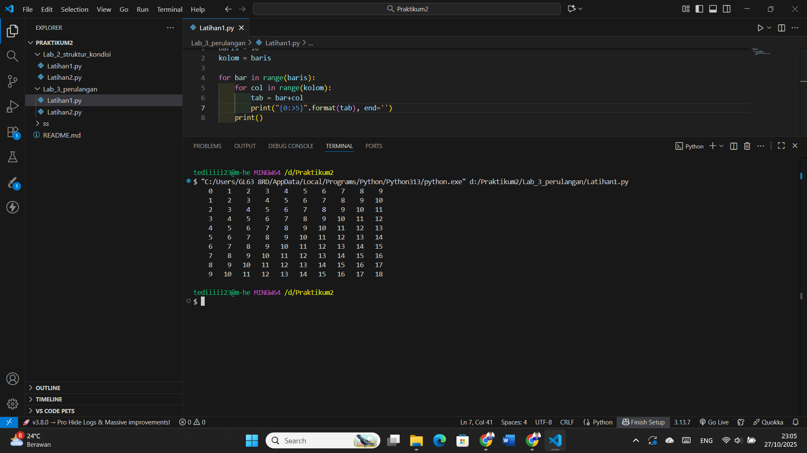
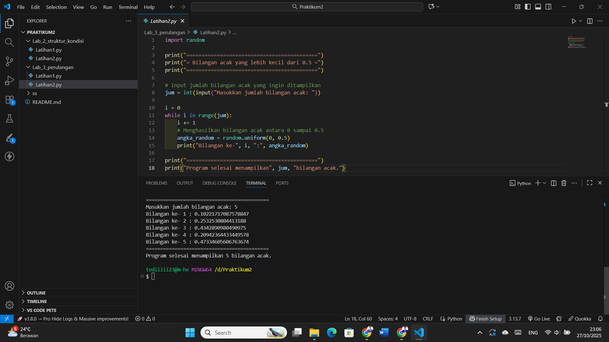

# Praktikum2 (labpy2)  

|  |  |
| -------- | --- |
| **Nama** | Tedi Mulyadi |
| **NIM** | 312510163 |
| **Kelas** | TI.25.A2 |
| **Mata Kuliah** | Pengantar Pemrograman |
| **Dosen** | Agung Nugroho, S.Kom., M.Kom. |  

---

## Tugas Lab 2: Struktur Kondisi

---  

- ### Latihan 1  

*Buat program sederhana dengan input 4 buah bilangan, kemudian tentukan bilangan terbesar dari kedua bilangan tersebut menggunakan statement if.*  

## Kode Program

 ```Python
# Program menentukan bilangan terbesar dari 4 bilangan

print("=== Program Mencari Bilangan Terbesar ===")

# Input 4 bilangan
a = int(input("Masukkan bilangan pertama: "))
b = int(input("Masukkan bilangan kedua: "))
c = int(input("Masukkan bilangan ketiga: "))
d = int(input("Masukkan bilangan keempat: "))

# Tentukan bilangan terbesar menggunakan if
terbesar = a  # misalnya a adalah yang terbesar

if b > terbesar:
    terbesar = b
if c > terbesar:
    terbesar = c
if d > terbesar:
    terbesar = d

# Tampilkan hasil
print("Bilangan terbesar adalah:", terbesar)
```  

## Hasil program
  

## Penjelasannya  

1. **Menampilkan Judul Program**
   ```python
   print("=== Program Mencari Bilangan Terbesar ===")
   ```
   Menampilkan teks pembuka ke layar.

2. **Input Bilangan**
   Program meminta pengguna memasukkan empat bilangan, dan setiap input dikonversi menjadi `int` (bilangan bulat).

3. **Proses Penentuan Bilangan Terbesar**
   Menggunakan pernyataan `if` untuk membandingkan satu per satu bilangan.

4. **Menampilkan Hasil**
   Program akan mencetak bilangan terbesar di antara keempat bilangan yang dimasukkan.

## Kesimpulan

Program ini menggunakan logika perbandingan sederhana dengan `if` untuk menentukan bilangan terbesar dari empat input angka.  

- ### Latihan 2  

*Buat program untuk mengurutkan data berdasarkan input sejumlah data (minumal 3 variable input atau lebih), kemudian tampilkan hasilnya secara berurutan mulai dari data terkecil.*  

## Kode Program

```python
print("=== Program Pengurutan Data ===")

# Input 3 bilangan dari pengguna
a = int(input("Masukkan bilangan pertama: "))
b = int(input("Masukkan bilangan kedua: "))
c = int(input("Masukkan bilangan ketiga: "))

# Proses pengurutan menggunakan kondisi if
if a > b:
    a, b = b, a
if a > c:
    a, c = c, a
if b > c:
    b, c = c, b

# Menampilkan hasil pengurutan
print("Urutan bilangan dari yang terkecil ke terbesar adalah:")
print(a, b, c)
```

## Hasil program
  

---

## Penjelasan Program
1. Program menampilkan judul `"=== Program Pengurutan Data ==="`.
2. Pengguna diminta untuk **memasukkan tiga bilangan**, yaitu `a`, `b`, dan `c`.
3. Program membandingkan nilai-nilai tersebut menggunakan tiga kondisi `if`:
   - `if a > b:` → jika benar, maka nilai `a` dan `b` ditukar.
   - `if a > c:` → jika benar, maka nilai `a` dan `c` ditukar.
   - `if b > c:` → jika benar, maka nilai `b` dan `c` ditukar.
4. Setelah semua perbandingan selesai, nilai `a`, `b`, dan `c` akan tersusun dari **yang terkecil ke terbesar**.
5. Hasil pengurutan kemudian ditampilkan ke layar.

---

### Input:
```
Masukkan bilangan pertama: 8
Masukkan bilangan kedua: 3
Masukkan bilangan ketiga: 5
```

### Proses:
- `a = 8`, `b = 3`, `c = 5`
- Setelah `if a > b`: tukar → `a = 3`, `b = 8`, `c = 5`
- Setelah `if b > c`: tukar → `a = 3`, `b = 5`, `c = 8`

---

## Kesimpulan
Program ini menunjukkan cara **mengurutkan tiga bilangan secara manual** menggunakan logika **kondisional (`if`)**.  
Metode ini sederhana namun efektif untuk memahami **dasar algoritma pengurutan (sorting)** tanpa menggunakan fungsi bawaan Python.

---  

---

## Tugas Lab 3 Perulangan

---

- ### Latihan 1  

*Buat program dengan perulangan bertingkat (nested) for yang menghasilkan output sebagai berikut:*  

  

## Kode Program

``` python
baris = 10
kolom = baris

for bar in range(baris):
    for col in range(kolom):
        tab = bar + col
        print("{0:>5}".format(tab), end='')
    print()
```

## Hasil program
  

---  

Program ini menggunakan **perulangan bertingkat (nested loop)** untuk
menampilkan tabel angka dengan jumlah baris dan kolom yang sama.\
Setiap nilai di dalam tabel merupakan hasil **penjumlahan antara indeks baris dan indeks kolom**.

---  

## Penjelasan Kode

1.  **baris = 10** → menentukan jumlah baris tabel.
2.  **kolom = baris** → jumlah kolom sama dengan jumlah baris.
3.  **for bar in range(baris)** → perulangan luar untuk setiap baris.
4.  **for col in range(kolom)** → perulangan dalam untuk setiap kolom.
5.  **tab = bar + col** → menghitung nilai yang akan dicetak.
6.  **print("{0:\>5}".format(tab), end='')** → mencetak nilai rata kanan
    tanpa pindah baris.
7.  **print()** → pindah ke baris baru setelah satu baris selesai
    dicetak.

## Kesimpulan

Program ini menghasilkan **tabel angka 10x10** yang disusun berdasarkan
hasil penjumlahan indeks baris dan kolom.\
Format keluaran menggunakan **rata kanan (width=5)** agar tampilan tabel
terlihat rapi.  

- ### Latihan 2  

---

- Tampilkan n bilangan acak yang lebih kecil dari 0.5.
- nilai n diisi pada saat runtime.
- anda bisa menggunakan kombinasi while dan for untuk
menyelesaikannya.  

## Kode Program  

```python
import random

print("===========================================")
print("= Bilangan acak yang lebih kecil dari 0.5 =")
print("===========================================")

# Input jumlah bilangan acak yang ingin ditampilkan
jum = int(input("Masukkan jumlah bilangan acak: "))

i = 0
while i in range(jum):
    i += 1
    # Menghasilkan bilangan acak antara 0 sampai 0.5
    angka_random = random.uniform(0, 0.5)
    print("Bilangan ke-", i, ":", angka_random)

print("===========================================")
print("Program selesai menampilkan", jum, "bilangan acak.")
```  
## Hasil program
 

---

## Penjelasan Program  

---

Program ini digunakan untuk menampilkan sejumlah bilangan acak dengan nilai antara **0 hingga 0.5**.  
Program memanfaatkan modul **`random`** dari Python dan menggunakan perulangan **`while`** untuk menampilkan bilangan acak sebanyak yang diminta oleh pengguna.  

---

1. **`import random`**  
   Mengimpor modul `random` untuk menghasilkan bilangan acak.

2. **Menampilkan judul program**  
   Menampilkan garis dan teks agar tampilan lebih rapi.

3. **Input jumlah bilangan acak**  
   Pengguna diminta memasukkan berapa banyak bilangan acak yang ingin ditampilkan.

4. **Perulangan `while`**  
   Program menggunakan perulangan `while` untuk menampilkan bilangan acak sebanyak jumlah yang dimasukkan.

5. **`random.uniform(0, 0.5)`**  
   Fungsi ini menghasilkan bilangan acak dengan nilai **antara 0 hingga 0.5**.

6. **Menampilkan hasil**  
   Setiap bilangan acak ditampilkan dengan nomor urutnya.

---

---

## Kesimpulan
Program ini menghasilkan bilangan acak antara **0 hingga 0.5** sebanyak jumlah yang diminta pengguna.  
Program menggunakan:
- Modul `random`
- Perulangan `while`
- Input dan output standar Python

---
